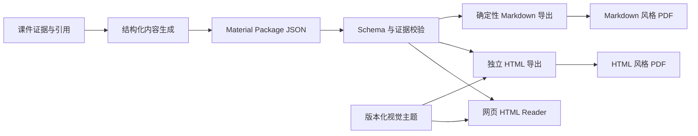

# Material Package JSON、HTML 与 Markdown 渲染设计

## 状态

- 决策日期：2026-07-28
- 状态：设计已获产品方向认可，尚未实施
- 适用范围：Single Courseware、Multi Courseware、Course Outline 的正式资料输出
- 首个模板：`clinical-standard@1.0.0`

## 核心决策

J-Study 不把 Markdown 或 HTML 作为长期内容契约。Markdown 重新成为正式
导出格式，但唯一内容源仍是 `material-package.v2`。

正式架构为：



约束如下：

1. Material Package JSON 是唯一正式内容数据源。
2. HTML 是网页阅读和主题化导出的产品形态。
3. Markdown 是简洁、可编辑的正式导出格式，但不是模型输入输出合同。
4. HTML 与 Markdown 都能生成各自视觉的 PDF。
5. 模型不得直接输出任意 HTML、CSS、JavaScript 或主题配置。
6. 视觉主题只改变呈现，不改变内容语义、引用和质量状态。

## 为什么不直接保存模型生成的 HTML

直接让模型生成 HTML 会导致：

- 页面结构和样式在不同任务之间漂移；
- 难以稳定识别章节、表格、公式和引用；
- 存在 XSS、危险 URL、脚本和样式注入风险；
- 模板升级时无法统一重新渲染旧资料；
- 课程合并、内容编辑、问题生成和知识片段复用更加困难；
- 质量检查只能依赖脆弱的字符串和 DOM 解析。

模型负责生成经过约束的内容结构，J-Study 负责把该结构渲染成统一 HTML。

## Material Package v2

### 顶层结构

首个正式版本使用 `material-package.v2`：

```json
{
  "schema_version": "material-package.v2",
  "package_id": "job-123",
  "service_mode": "course_outline",
  "title": "课程学习资料",
  "subject": "medicine",
  "language": "zh-CN",
  "source_ids": ["S001", "S002"],
  "sections": [],
  "rendering": {
    "default_theme": {
      "theme_id": "clinical-standard",
      "theme_version": "1.0.0"
    }
  }
}
```

顶层结构不保存完整证据正文。Evidence 继续由 owner-checked API 管理，Package 只保存稳定的 `evidence_id` 引用。

### Section 结构

每个章节直接拥有正文 blocks，不再依赖前端从一个完整 Markdown 文件中按标题切分：

```json
{
  "id": "section-001",
  "order": 1,
  "title": "急性心肌梗死",
  "status": "generated",
  "quality": {
    "evidence_status": "sufficient",
    "evidence_count": 4
  },
  "source_ids": ["S001"],
  "evidence_ids": ["E001", "E002"],
  "blocks": []
}
```

`status` 延续明确状态，不允许前端根据正文是否为空猜测：

- `generated`
- `weak_evidence`
- `failed`

### 初始 Block 类型

第一版只实现正式学习资料当前需要的类型：

- `heading`：章节内部的小标题，只允许语义层级 3 或 4；
- `paragraph`：正文段落；
- `list`：有序或无序列表；
- `table`：表头与二维行数据；
- `callout`：`key_point`、`note`、`warning` 三种受控强调块；
- `formula`：受控 LaTeX 公式。

第一版不实现任意 HTML block、iframe、视频、远程组件或自定义脚本。图片 block 等 MinerU 资产链路稳定后再单独设计。

### Inline Run

段落、标题、列表项和表格单元格由受控 inline runs 组成：

```json
{
  "id": "block-001",
  "type": "paragraph",
  "runs": [
    {
      "type": "text",
      "text": "肌钙蛋白升高支持心肌损伤判断。"
    },
    {
      "type": "citation",
      "evidence_id": "E001"
    }
  ]
}
```

第一版允许：

- `text`
- `strong`
- `emphasis`
- `inline_code`
- `inline_formula`
- `citation`

引用是正式结构，不再使用 `<!-- evidence: E001 -->` 注释，也不再由前端正则替换。

## 生成与校验

生成阶段按 section 产生结构化 JSON，而不是整门课程的一段 Markdown。

要求：

1. 使用 provider 支持的 JSON Schema 或等价 structured-output 能力。
2. 每个 section 独立验证，避免一个章节格式错误破坏整个课程。
3. Block id 在 section 内唯一且稳定。
4. Citation run 引用的 evidence id 必须属于当前 job，并出现在 section 的 `evidence_ids` 中。
5. 表格必须限制列数、行数和单元格长度。
6. heading level、callout variant 和 formula 字段使用枚举校验。
7. 最多允许一次受控格式修复；仍不合法时将 section 标记为 `failed`，不得回退为不受控 HTML。
8. 模型原始响应可作为私有诊断 artifact 保存，不进入用户 API。

质量检查直接遍历 blocks 和 citation runs，计算章节引用覆盖率，不再解析 Markdown 标题或 HTML 注释。

## HTML Renderer

### 交互式 Reader

Next.js Reader 使用一个集中式 Material Renderer：

```text
apps/web/src/features/material-renderer/
  material-renderer.tsx
  block-registry.tsx
  inline-runs.tsx
  themes/
  export/
```

每种 block type 只对应一个受控组件。业务页面不得自行解释 Package 字段，也不得在多个模块复制 renderer。

Reader 保持现有三栏边界：

- 左侧：章节和来源导航；
- 中间：Material Package HTML；
- 右侧：PDF source preview。

点击 citation run 继续使用 `job_id + source_id + page + chunk_id` 定位，只滚动右侧 source preview。

### HTML、Markdown 与 PDF 导出

第一版 HTML 导出由同一个 TypeScript renderer 在用户端生成并下载：

- 输出语义化 HTML；
- 内嵌所选主题 CSS；
- 不包含 JavaScript；
- 不依赖外部字体、CDN 或运行时接口；
- 引用显示 evidence label 和来源页信息；
- 提供打印 CSS，可从浏览器打印为 PDF；
- 文本和属性统一转义；
- 使用限制脚本、对象和外部连接的 CSP meta。

Markdown 导出由独立的确定性 renderer 从同一个 Package 生成：

- 不读取或转换已经渲染的 HTML；
- 使用统一的简洁文档结构；
- 保留章节、表格、公式、Citation 标签和质量状态；
- 对失败章节和弱证据章节生成明确提示。

HTML 与 Markdown 使用不同打印视图。第一版调用浏览器打印能力生成
各自风格的 PDF；不在生产服务器部署 Chromium。只有真实使用证明需要
一键稳定下载、批量导出或统一分页时，才增加服务器 PDF Renderer。

第一版不要求后端持久化渲染后的 HTML。后端保存 Material Package JSON，避免内容与导出副本漂移。只有在未来出现服务端分享、邮件发送或批量归档需求时，才评估服务端 HTML artifact。

## 主题系统

### Theme Manifest

主题必须版本化：

```json
{
  "theme_id": "clinical-standard",
  "theme_version": "1.0.0",
  "display_name": "Clinical Standard",
  "renderer_contract": "material-renderer.v1",
  "tokens": {},
  "component_variants": {},
  "print": {}
}
```

Theme Manifest 可以控制：

- 字体族与字号；
- 页面宽度和阅读行长；
- 背景、文字、边框和语义色；
- 间距、圆角和分隔线；
- heading、table、callout、citation 的受控样式；
- 打印分页、页边距和黑白适配。

第一阶段主题不得控制：

- 内容顺序；
- block 类型；
- section 拆分；
- 引用位置；
- soul profile；
- 检索规则；
- 任意 CSS、脚本或外部资源。

### 实施阶段

1. 只实现 `clinical-standard@1.0.0`。
2. 主题切换入口保持隐藏，直到至少有两套经过桌面、移动端和打印验收的主题。
3. 第二阶段只开放 token 和组件样式差异。
4. 双栏、章节封面和图片编排属于未来 layout profile，不与第一版 theme 混合。
5. 用户切换主题不会修改 Material Package。
6. 每次导出记录明确的 `theme_id`、`theme_version` 和 renderer version。
7. 已导出的文件保持不变；重新渲染新主题必须是显式操作，禁止静默改变旧资料。

## 与 Soul、Domain 和 Service Mode 的边界

四个概念必须独立：

| 概念 | 决定什么 |
| --- | --- |
| `service_mode` | 用户上传什么，系统如何组织生成任务 |
| domain pack | 学科规则、检索和质量策略 |
| soul profile | 内容表达、组织重点和学科教学风格 |
| HTML theme | 字体、颜色、间距、组件样式和打印外观 |

HTML theme 不进入 retrieval、evidence selection 或 generation prompt。

## 安全边界

- Package schema 中不存在 raw HTML、raw CSS 或 raw script 字段；
- 所有文字均按普通文本转义；
- URL 不由模型直接提供；
- citation 必须映射到 owner-owned evidence；
- formula renderer 关闭不受信任扩展和危险命令；
- 导出 HTML 不执行脚本；
- Theme Manifest 由仓库中的受审代码或配置提供，不接受用户上传；
- 主题 token 使用字段白名单和取值限制；
- 不把模型输出写入 `dangerouslySetInnerHTML`。

## 迁移策略

当前 `material_package` 只有章节元数据，正文仍保存在一个 Markdown artifact 中，前端再按标题切分。迁移按以下顺序进行：

1. 增加 `material-package.v2` typed schema 和 validator；
2. generation stage 直接生成 section blocks 和 citation runs；
3. Package API 返回 v2 JSON；
4. Reader 改用 Material Renderer，不再调用 `splitMarkdownBySections()`；
5. 增加 `clinical-standard@1.0.0`、独立 HTML 导出和确定性 Markdown Renderer；
6. 用新的 Package-based Markdown Renderer 替换旧 `/output` 兼容实现；
7. 后端、前端和真实浏览器回归通过后，删除 Markdown section splitter 和 evidence comment replacement。

不保留以 Markdown 为正文数据库的长期双写。兼容期结束后，
Material Package v2 是唯一真实内容源，Markdown 只是可重复生成的正式导出。

## 与当前重构顺序的关系

本设计不扩大下一阶段 Jobs/PostgreSQL/worker 任务。Job、source、section 和 artifact 持久化仍应先完成。

HTML 迁移应进入 Generation Modules 与 API/Frontend Contract 阶段，拆为三个窄任务：

1. Material Package v2 schema、结构化生成和质量检查；
2. React Material Renderer、Clinical Standard、HTML 与 Markdown 导出；
3. 两种浏览器打印视图和旧 Markdown compatibility path 收口。

不得把数据库迁移、MinerU pipeline switch、HTML renderer 和多主题同时塞进一张任务卡。

## 验收标准

### Contract

- Package v2 通过后端 typed schema 校验；
- 不合法 block、未知 evidence id 和 raw HTML 字段被拒绝；
- section 顺序、source id 和 evidence id 在重试后稳定；
- OpenAPI 和 TypeScript 类型一致。

### Renderer

- 每种 block 都有 focused component test；
- citation 点击只滚动 source preview；
- 同一 Package 在刷新后恢复相同内容；
- HTML export 可以离线打开；
- Markdown export 可以离线编辑并保持章节、Citation 和质量提示；
- HTML 与 Markdown 打印视图生成不同视觉但相同内容的 PDF；
- 导出文件无脚本、无远程资源和未转义模型内容；
- Clinical Standard 在 `390x844`、`768x1024`、`1440x900` 无横向溢出。

### Theme

- Theme id、theme version 和 renderer version 可追踪；
- 主题只影响视觉，不改变文本、section、source 或 evidence；
- 屏幕与打印样式分别验收；
- 旧主题版本不会被同名新配置静默覆盖。

### Regression

- Course Outline 上传、Job polling、章节切换、citation jump、刷新恢复和完整导出通过真实浏览器 E2E；
- owner check 继续覆盖 package、evidence、source preview 和 export；
- 旧 Markdown 兼容代码只在 Package-based Markdown Renderer 通过后删除。

## 非目标

第一版不做：

- 多套可选主题；
- 用户上传模板；
- 可视化模板编辑器；
- 任意 HTML/CSS；
- 双栏或杂志式 layout profile；
- 服务端公开分享页面；
- PWA、国际化或通用文档编辑器；
- 口诀、思维导图、对比表格和高频考点等额外生成模式。

当前目标是用稳定的 Material Package JSON 生成统一、安全、可追溯的
HTML Reader、HTML 导出、Markdown 导出和两种打印视图。
