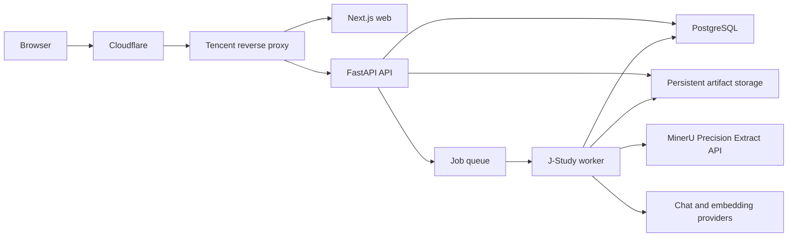
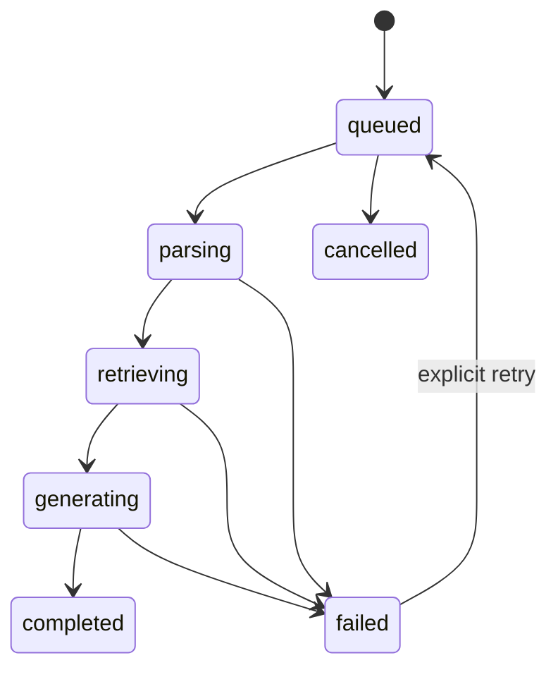

# J-Study Contract-First Refactor Blueprint

## Status

Approved direction as of 2026-07-28.

This document supersedes the earlier assumption that PyMuPDF is the
product-facing default parser. Historical plans and task cards remain unchanged
as implementation history.

## Product Decisions

- J-Study remains a multi-discipline product with medicine as the first validated
  domain.
- Course Outline Mode is the first complete product workflow.
- All product document extraction uses MinerU.
- Users do not choose a parser and do not see parser tiers.
- PyMuPDF remains an internal PDF utility for validation, metadata, and page
  rendering. It is not a source of study text.
- The pilot sends uploaded courseware to the MinerU Precision Extract cloud API.
- Next.js, FastAPI, PostgreSQL, and persistent file storage run on Tencent Cloud.
- The spare computer is not part of the initial production path. It may later run
  a private MinerU worker behind the same parser contract.
- Existing databases, uploads, and generated jobs are test data and may be
  deleted during migration.
- Soul Profiles, Knowledge Snippets, product documents, and admin configuration
  schemas are durable product assets and must be preserved.

## Why Refactor

The current MVP proves the main workflow, but several responsibilities are
concentrated in large files:

- `apps/api/jstudy_api/app.py` combines app construction, authentication,
  authorization, uploads, job execution, admin routes, artifacts, and PDF
  rendering.
- `packages/core/jstudy_core/pipeline.py` combines parsing, outline handling,
  retrieval, generation, citations, quality checks, and artifact assembly.
- Job metadata is split between SQLModel authentication data, JSON job records,
  filesystem paths, and loosely typed dictionaries.
- Parser selection is exposed as a product option even though the approved
  product now has one quality baseline.
- The MinerU adapter is still a stub.

The goal is not a clean-slate rewrite. The goal is to preserve verified behavior
while replacing internal boundaries one vertical slice at a time.

## Architecture Principles

1. Preserve working public behavior before moving code.
2. One source of truth per contract.
3. External provider output is never consumed without validation and
   normalization.
4. Job state is explicit and persisted.
5. FastAPI routes translate HTTP only; application services own workflows.
6. Domain assets do not depend on HTTP, storage, or a specific model provider.
7. Storage and MinerU implementations are replaceable behind narrow interfaces.
8. Every phase leaves a runnable, tested application.

## Target Runtime



The first production-like deployment may run API and worker from the same image,
but they must be separate processes. A web request must not perform a full
MinerU and LLM pipeline synchronously.

## Target Repository Boundaries

```text
apps/
  api/jstudy_api/
    app.py                  application composition only
    dependencies.py         request-scoped dependencies
    routes/
      auth.py
      admin.py
      options.py
      jobs.py
      artifacts.py
      health.py
    schemas/
      auth.py
      jobs.py
      options.py
  web/
    src/app/
    src/features/
    src/lib/api/

packages/core/jstudy_core/
  documents/
    models.py               normalized parser contracts
    service.py              parse orchestration and cache lookup
    mineru_client.py        MinerU Precision Extract transport
    mineru_normalizer.py    MinerU ZIP/content-list normalization
    pdf_utility.py          PyMuPDF validation/metadata/rendering only
  jobs/
    models.py               job, source, section, and artifact records
    states.py               state transitions and progress rules
    repository.py           persistence interface
    service.py              submit, inspect, cancel, retry
  generation/
    single_courseware.py
    course_outline.py
    retrieval.py
    artifacts.py
    quality.py
  content/
    scenarios.py
    soul_profiles.py
    snippets.py
  providers/
    chat.py
    embeddings.py
    web_search.py

packages/domains/
  medicine/
    profile files and optional domain rules
```

This is a target boundary, not a requirement to create every file in one pull
request. A file is introduced only when the phase that owns its behavior is
implemented.

## Document Contract

MinerU provider-specific responses are normalized before retrieval:

```text
ParsedDocument
  contract_version
  source_id
  source_file
  source_sha256
  parser_name
  parser_version
  parser_model
  page_count
  pages[]
  warnings[]
  provider_trace_id

ParsedPage
  page_number             one-based J-Study page number
  text
  markdown
  blocks[]

ParsedBlock
  block_id
  kind                    title | text | list | table | formula | image | code
  text
  markdown
  bbox
  asset_path
  metadata
```

Rules:

- MinerU `page_idx` is zero-based and must be converted once at the normalization
  boundary.
- `source_id` is assigned and persisted by J-Study before parsing. MinerU and
  filenames never generate identity.
- Retrieval consumes `ParsedPage` or normalized chunks, never raw MinerU JSON.
- The stable input is MinerU `content_list.json`. Experimental
  `content_list_v2.json` may be stored for inspection but is not the contract.
- The original MinerU ZIP and normalized result are private job artifacts.
- Cache identity is the source SHA256 plus parser/model/options/normalizer
  versions.
- Remote URLs from MinerU are downloaded with timeouts, size limits, and host
  validation. ZIP extraction rejects traversal paths and decompression bombs.

## Parser Policy

Product policy:

```text
text and structure extraction -> MinerU only
PDF validation/page count/rendering -> PyMuPDF utility
```

The frontend no longer submits `parser_profile_id`. The backend may accept the
old field temporarily for compatibility, but it must ignore it or reject any
non-empty value with a documented migration error. Parser configuration belongs
to the admin/runtime layer:

- API base URL
- API token
- model version, initially `vlm`
- language
- table/formula/OCR settings
- polling interval and deadline
- download size limit
- retry policy

There is no silent fallback from MinerU extraction to PyMuPDF text extraction.
If MinerU is unavailable, the job fails with a stable parser error code and may
be retried.

## Job State Machine



Required persisted fields:

- job id and owner user id
- service mode and scenario id
- state, progress, error code, and safe user message
- source records with stable source ids and SHA256
- outline record and parsed sections
- provider task ids and retry count
- section progress
- artifact records
- timestamps and retention deadline

The API returns stable states. The frontend must not infer stages from messages
or artifact presence.

## Persistence Policy

Production:

- PostgreSQL stores users, sessions, jobs, sources, sections, artifacts, and
  state transitions.
- A mounted persistent volume stores pilot uploads, MinerU results, generated
  output, previews, and exports.
- Storage access goes through an interface so Tencent COS can replace the local
  implementation later.

Development and tests may use SQLite and temporary directories.

The current `jobs.json`, SQLite test database, uploads, and generated outputs are
not migrated. They are deleted only after a verified repository checkpoint is
created.

## API Contract Policy

- Preserve existing route paths needed by `apps/web` during the refactor.
- Define request and response bodies with Pydantic models.
- Set an explicit OpenAPI/API contract version.
- Generate or validate frontend TypeScript types from OpenAPI.
- Keep `service_mode`, `scenario_id`, and future output style separate.
- Remove parser selection from the public options and upload contracts.
- Continue owner checks on every job, source, preview, export, and artifact
  endpoint.
- Do not return provider tokens, signed upload URLs, server paths, or raw
  exceptions.

## Frontend Policy

The approved Clinical Workbench information architecture remains valid:

```text
login -> mode selector -> Course Outline upload -> job reader
```

The frontend changes only when backend contracts change:

- remove parser profile types and request fields
- consume the explicit job state machine
- show parser failures using stable error codes/messages
- preserve source-id-based citation jumps
- keep all API types in `apps/web/src/lib/api`

The visual design is not restarted during the backend refactor.

## Vertical Assets

Soul Profiles and Knowledge Snippets remain the product's differentiating
assets:

- Soul Profiles define subject-specific teaching and generation behavior.
- Knowledge Snippets remain reviewed, scenario-scoped secondary retrieval
  material.
- Neither asset is embedded into API route modules or a global prompt string.
- Blank subject profiles remain disabled.
- Runtime user data may be reset; curated asset files and schemas may not.

## Deployment Policy

Initial production path:

```text
Cloudflare -> Tencent Cloud -> Next.js/FastAPI/PostgreSQL/worker/storage
                                 |
                                 -> MinerU cloud API
```

The spare computer is reserved for:

- local MinerU quality and latency comparison
- a future outbound worker that claims jobs from Tencent Cloud
- emergency or cost-control capacity

It is not a database host, public API host, or mandatory production dependency.

## Refactor Phases

### Phase 0: Verified checkpoint

- Inventory tracked and untracked product work.
- Scan for secrets and runtime data.
- Run backend and frontend test baselines.
- Commit the accepted 0002-0004 product state as a checkpoint.
- Tag or record the checkpoint SHA in the refactor report.

### Phase 1: MinerU document foundation

- Add normalized document models.
- Add MinerU Precision Extract client and output normalizer.
- Split PyMuPDF utilities from text extraction.
- Add parser cache identity and security checks.
- Keep existing generation output behavior.

### Phase 2: Jobs and persistence

- Introduce the explicit state machine.
- Move job/source/section/artifact metadata to SQLModel/PostgreSQL.
- Separate API and worker processes.
- Add idempotency, retry, progress, cleanup, and concurrency limits.

### Phase 3: Generation modules

- Split Course Outline generation into parse, retrieve, generate, package, and
  quality stages.
- Preserve citation and material-package contracts.
- Remove legacy runner dispatch and root CLI shims after compatibility tests.

### Phase 4: API and frontend contract

- Split FastAPI routes and typed schemas.
- Freeze OpenAPI contract version.
- Generate or validate TypeScript API types.
- Remove public parser selection.
- Update reader polling to the explicit state machine.

### Phase 5: Production-like deployment

- Deploy the smallest real vertical slice on Tencent Cloud.
- Verify same-domain cookies, proxy headers, volumes, PostgreSQL, worker, MinerU
  connectivity, logs, retention, backup, and rollback.
- Run real-browser E2E at mobile, tablet, and desktop sizes.

### Phase 6: Product expansion

- Improve Soul Profile and Knowledge Snippet administration.
- Add Batch Courseware Mode.
- Evaluate Tencent COS and the spare-computer MinerU worker.
- Add past-paper question generation only after the base workflow is measured.

## Deletion Gate

Code may be deleted only when:

1. its replacement is covered by focused tests;
2. the complete backend and frontend suites pass;
3. no active route or import uses it;
4. the checkpoint SHA is recorded;
5. the Supervisor approves the deletion.

This applies especially to:

- PyMuPDF text extraction
- parser-profile routing
- `jobs.json`
- in-process job execution
- temporary backend HTML UI
- root CLI compatibility shims

## Definition of Done

The refactor is complete when:

- Course Outline Mode works through MinerU cloud parsing end to end.
- API and worker are independently restartable.
- Job state and ownership survive restart in PostgreSQL.
- Source ids and citation jumps remain stable.
- No public parser choice remains.
- PyMuPDF is used only for PDF utilities.
- OpenAPI and frontend types agree.
- uploads, polling, reader, export, failure, and refresh recovery pass real
  browser tests.
- the Tencent Cloud release has a manifest, backup, rollback point, and
  production-like verification evidence.
