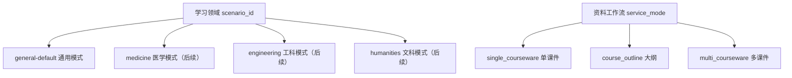
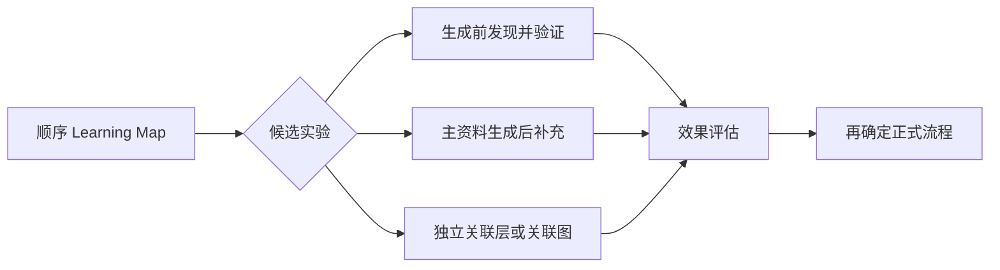

# J-Study 学科模式与资料工作流

状态：模式合同已确认；跨课件关联算法待实验
最后更新：2026-08-01

本文档是 J-Study 模式体系的产品事实来源。后端字段、前端入口和路线图应与本文保持一致。

## 1. 两个独立维度

J-Study 不使用一个含义模糊的 `mode` 同时表示学科、输入形式和输出风格。产品只保留两个与本设计直接相关的维度：

### 学习领域

- 产品默认模式是 `general-default`。
- 通用模式不检测学科、不推荐专业模式，也不根据课件内容静默切换。
- 后续专业模式按医学、工科、文科等大类提供。
- 专业模式复用相同的资料工作流，只改变 Soul Profile、Knowledge Snippet、术语规则、内容重点和质量标准。
- 管理员控制哪些专业模式对用户可见，用户必须主动选择。

当前代码仍以 `medicine-default` 作为主要可用 Scenario。将产品默认值切换为 `general-default` 前，必须先提供真实可用的通用 Soul Profile 和质量规则，不能启用空白占位配置。

### 资料工作流

`service_mode` 只决定用户提交什么资料，以及系统如何组织生成。它不决定学科配置、MinerU 解析器、模型供应商或网页美术模板。

## 2. 严格输入合同

| `service_mode` | 用户输入 | 核心价值 |
|---|---|---|
| `single_courseware` | 恰好 1 份 PDF，不接受大纲 | 按一份课件的教学顺序生成同步资料 |
| `course_outline` | 恰好 1 份大纲，至少 1 份 PDF | 使用大纲匹配、命名和组织一门课程的课件 |
| `multi_courseware` | 至少 2 份 PDF，不接受大纲 | 按同一门课程的课件顺序生成，并主动发现跨课件知识关联 |

三个工作流互斥：

- 单课件提交大纲时应提示改用大纲模式。
- 多课件模式不接受可选大纲，避免与大纲模式重叠。
- 工作流提交后不做中途转换。用户选错时返回明确校验信息，由用户重新选择。
- 不再扩展 metadata-only `mode`；该兼容字段应在正式前端和替代路径稳定后删除。

## 3. 多课件模式边界

多课件模式只面向同一门课程中的一组连续课件，不面向任意主题相近的 PDF 集合。

多课件模式不是多个单课件 Job 的简单循环。它必须同时提供：

1. 每份课件内部按页码和 MinerU block 顺序推进；
2. 课件之间按用户确认的 `display_order` 推进；
3. 主学习资料保持 sequence-first；
4. AI 主动发现不同课件间有助于巩固理解的知识关联。

`source_id` 在上传后保持稳定。自动排序、用户拖动或重命名只能改变 `display_order` 和 `display_title`，不能重新分配来源身份。

## 4. 跨课件关联目标与实验边界

跨课件关联的具体生成流程暂不固定。生成前发现、生成后补充和独立关联层都属于候选方案，必须使用同一组代表性课件进行效果、成本和稳定性测试后再选择。

无论最终选择哪种方法，都必须满足以下产品约束：

- 只比较不同 `source_id` 的学习单元。
- 语义相似度或模型判断不能改变 Learning Map 和主学习顺序。
- 任何显示给用户的关联都必须能够回到双方的课件证据。
- 关系类型至少区分前置知识、相同机制、相似机制、对比关系、后续延伸和应用补充。
- 一个学习单元只保留少量高价值关联；重复关系合并为一段“知识关联”。
- 关联发现或验证失败时，省略关联并继续主资料生成，不能让整个 Job 失败。
- 第一版不因某个候选方案实现方便就提前承诺独立关联图。

正式选型前至少比较：

- 关联准确性和双侧证据有效性；
- 对理解和复习是否真正有帮助；
- 重复、牵强和歧义关联的比例；
- 对主课件顺序和阅读连贯性的干扰；
- 模型调用成本、总延迟和失败率；
- 是否能稳定生成简洁自然的中文关联表达。

## 5. Reader 展示规则

跨课件关联以自然语言就近展示，例如：

> 在《球菌》课件中提到的荚膜抗吞噬作用，与此处的免疫逃逸机制相同。

展示规则：

- 可以明确显示相关课件的 `display_title`。
- 正文不生成跨课件跳转链接。
- 后端保留双方 `source_id`、页码、block、Evidence 和关系类型，用于验证、审计和未来关联图。
- 跨课件关系使用 `navigation_policy=non_interactive`。
- 右侧课件只能通过章节推进或用户主动操作切换。
- 同一课件内部的 Citation 仍可进入 Inspect Mode，并保留返回原学习位置的能力。

## 6. 当前实现状态

已经实现：

- `single_courseware` 与 `course_outline` 后端路径；
- Worker 强制使用 MinerU 进行产品文本和结构提取；
- `courseware-manifest.v1`、`learning-map.v1`、`coverage-ledger.v1`；
- sequence-first `material-package.v2` 生成；
- 稳定 `source_id`、来源预览和 owner-scoped artifact API。

尚未实现：

- `general-default` 的真实通用 Soul Profile 和默认切换；
- `multi_courseware` admission、关联实验基线和正式生成路径；
- 三个工作流的正式前端入口；
- Courseware Organizer 的自动排序、差异展示、拖动、改名和 Manifest 确认；
- 正式 Reader 的跨课件自然语言关联展示。

当前 API 对单课件 optional outline 的兼容行为与目标产品合同不一致。后续实现任务应先增加新合同和迁移测试，再删除旧兼容行为。

## 7. 轻量化原则

第一版不做：

- 学科自动识别或模式推荐；
- 工作流中途转换；
- 多课件可选大纲；
- 任意 PDF 集合的知识图谱；
- 跨课件正文跳转；
- 独立关联图页面；
- 用户可见的解析器选择；
- 为未来假设提前增加新的 mode 字段。
