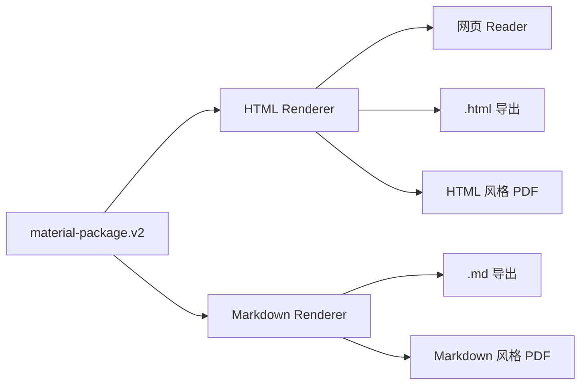

# J-Study 学习资料与导出合同

状态：已确认的产品设计
最后更新：2026-08-02

本文档定义通用模式生成什么内容、如何处理课件外补充、局部失败如何交付，以及 HTML、Markdown 和 PDF 的正式导出边界。

## 1. 唯一内容源

`material-package.v2` 是学习资料的唯一正式内容源。模型不分别生成 HTML、Markdown 和 PDF，也不直接生成可执行的 HTML、CSS 或 JavaScript。

所有渲染格式必须保持相同的章节顺序、正文语义、Citation、质量状态和失败状态。视觉主题只改变呈现，不改变内容。

## 2. 通用模式内容结构

通用模式采用“最小固定骨架 + 可选内容块”。

每个有效学习单元必须包含：

- 章节标题；
- 核心讲解；
- 可追溯的课件依据。

根据课件内容按需使用：

- 定义；
- 分点列表；
- 对比表格；
- 公式；
- 流程步骤；
- 示例；
- 易错点；
- 记忆提示；
- 知识关联；
- 补充理解；
- 内容核对。

模型不得为了形式完整而强行生成所有内容块。HTML 主题和 Markdown 排版共享相同的结构化 block 语义。

## 3. 资料深度与覆盖

通用模式默认生成完整学习资料，不增加“精简/详细”选择。

“完整”表示：

- 覆盖所有有效课件内容；
- 按连续学习单元组织，不机械地一页生成一节；
- 提供理解所必需的解释，但不进行无关扩写；
- 保留关键定义、机制、公式、流程、对比和例子；
- 支持网页逐章节阅读和完整导出。

封面、目录、空白、重复和低信息内容不需要逐页复述：

- 封面、目录和空白 block 可以忽略；
- 重复内容合并到首次有效出现的位置；
- 低信息页面可以与相邻页面合并；
- 所有未进入正文的有效页面或 block 必须在 Coverage Ledger 中记录原因；
- 第一版前端只展示简要覆盖状态，不暴露完整技术账本。

## 4. 受控补充知识

课件内容始终是正文主体。课件外知识只能用于填补理解断点，不能把资料扩展成另一套教材。

补充来源优先级：

1. 当前课件证据；
2. 当前学习领域审核通过的 Knowledge Snippet；
3. 模型已有知识，仅用于必要解释；
4. Web Search 不进入默认生成链路，后续仅作为用户主动触发的独立能力评估。

补充规则：

- 使用独立的“补充理解”内容块；
- 不得伪造课件页码、Evidence 或 Citation；
- 删除补充块后，主资料仍必须完整可读；
- Approved Knowledge Snippet 必须保留自身审核和来源元数据；
- 模型知识不冒充已审核 Snippet。

## 5. 课件冲突与内容核对

当 Snippet 或模型知识提示课件可能存在错误、过时表述或争议时，系统不自动替换课件内容。

系统应：

- 保留课件原意；
- 使用独立的“内容核对”提示；
- 明确区分课件表述与补充说明；
- 使用“可能需要核对”等克制措辞；
- 只有存在实际冲突、过时风险或明显歧义时才显示；
- 在后台保留触发提示的 Snippet 或补充依据；
- 依据不足时不生成核对提示。

## 6. 局部失败与定向重试

多章节资料不得因为一个章节生成失败而丢弃全部成功结果。

产品合同：

- Section 状态继续使用 `generated`、`weak_evidence` 和 `failed`；
- 至少有一个可用章节时，Job 可以完成并返回失败章节汇总；
- 所有章节均失败时，Job 才进入 `failed`；
- 用户可以只重试失败章节；
- 定向重试复用原始 PDF、MinerU 结果、Courseware Manifest 和 Learning Map；
- 已成功章节不重新生成；
- 重试后的发布必须保持章节身份、顺序和来源身份稳定。

存在失败章节时仍允许网页阅读和导出。导出文件必须：

- 保留原章节顺序；
- 在顶部显示“部分内容未完成”；
- 在失败章节原位置显示明确占位信息；
- 不静默删除失败章节；
- 使用不同视觉区分 `failed` 与 `weak_evidence`。

## 7. 导出格式

第一版正式提供两种内容导出：

### HTML

- 下载独立 `.html` 文件；
- 使用用户选择的版本化视觉主题；
- 内嵌必要 CSS，不依赖远程字体、CDN 或运行时 API；
- 不包含可执行 JavaScript；
- 提供打印样式。

### Markdown

- 下载确定性生成的 `.md` 文件；
- 使用统一、简洁、便于编辑的结构；
- 保留章节、表格、公式、Citation 标签和质量提示；
- Markdown 是受支持的导出格式，但不是内容数据库或模型生成源。

## 8. PDF 分阶段交付

HTML 和 Markdown 都支持独立的 PDF 视觉：

- HTML PDF 保留所选主题；
- Markdown PDF 使用统一的黑白文档排版。

交付阶段：

1. 第一版使用浏览器打印视图生成 PDF，不在服务器部署 Chromium；
2. 真实使用证明需要一键稳定下载、批量导出或统一分页后，再增加服务器 PDF Renderer；
3. 服务器 PDF 必须继续消费 `material-package.v2`，不得以已经导出的 HTML 或 Markdown 作为新的内容源。

## 9. 当前实现状态

已经实现：

- strict `material-package.v2`；
- typed sections、blocks、citation runs 和质量状态；
- Markdown compatibility artifact。

尚未实现：

- 正式 React HTML Renderer；
- 可下载的独立 HTML；
- 作为正式产品能力的确定性 Markdown Renderer；
- HTML 与 Markdown 两种打印视图；
- 浏览器 PDF 验收；
- 局部失败汇总和失败章节定向重试；
- 通用模式的可选 block、补充理解和内容核对合同。
