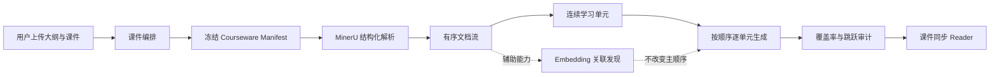
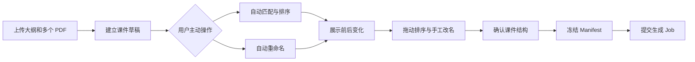

# J-Study 课件同步学习设计

## 状态

- 决策状态：已确认
- 产品讨论来源：Codex 任务 `019ed023-8e41-7ad0-8117-6246b8ffa0bb`
- 适用范围：Course Outline Mode 优先，随后复用于 Single Courseware 与 Batch Courseware
- 当前代码状态：MinerU 基础能力已完成，但生成主链路仍使用 PyMuPDF 和相关性优先检索

本文覆盖产品最终合同和分阶段实现边界。它不表示所有能力已经完成。

## 一、产品定位

J-Study 不是通用 PDF 问答工具，也不是把课件内容重新拼成一篇主题摘要的 RAG 工具。

J-Study 的核心产品承诺是：

> 尊重教师原有的课件顺序，为课件增加一层可阅读、可追溯、可与原页面同步的学习资料。

完整资料生成以课件覆盖和学习顺序为第一目标。语义检索仍有价值，但它负责发现关联，不负责决定正文顺序。



## 二、已确认的产品原则

### 1. 课件顺序是主学习路径

- 顶层顺序优先由用户确认后的课件顺序决定。
- 单份课件内部按原始页码和 MinerU block 顺序推进。
- 上传大纲时，大纲用于章节命名、分组和匹配，不得随意打乱课件内部顺序。
- 不要求所有 citation 页码绝对单调，但每个学习单元必须有连续的主页面范围。
- 语义相关性不能把第 90 页排到第 12 页之前作为主讲内容。

### 2. Embedding 是辅助能力

Embedding 可以用于：

- 发现前置知识、相似机制、对比关系和后续延伸；
- Knowledge Snippet Library 语义查重；
- 用户后续问答和搜索；
- 点赞片段聚类；
- 生成完成后的关联图。

Embedding 不得决定：

- 哪些有效页面能够进入正式资料；
- 主资料先讲什么、后讲什么；
- Reader 自动跟随哪一页；
- 一个学习单元的主要页面范围。

### 3. MinerU 是唯一产品正文解析器

- 所有用户课件的文字和结构提取统一使用 MinerU。
- Markdown/TXT 大纲使用严格 UTF-8 读取；PDF 大纲同样通过 MinerU 提取，
  但使用内部 outline identity，不进入用户课件 source 列表。
- PyMuPDF 只负责 PDF 魔数与损坏校验、页数和尺寸、页面 PNG 渲染以及 MinerU 页码验证。
- 前端不提供解析器选择。
- MinerU 失败时返回稳定错误并允许重试，不静默退回 PyMuPDF 正文提取。
- MinerU 原始响应不能泄漏到 retrieval、generation 或 frontend；这些模块只消费 J-Study `ParsedDocument`。

### 4. Source identity 与显示信息分离

`source_id` 在文件接收后分配并永久稳定。它不因以下操作变化：

- 自动排序；
- 用户拖动排序；
- 自动重命名；
- 用户手工改名；
- Worker 重试；
- PDF 预览请求。

以下字段属于显示和编排信息：

- `original_filename`：原始文件名，只读；
- `display_title`：用户看到的课件标题；
- `display_order`：课件学习顺序；
- `primary_outline_section_id`：主要对应的大纲章节；
- `title_origin`：`upload | auto | user`；
- `order_origin`：`upload | auto | user`。

手工修改优先于自动结果。再次自动整理时，默认不得覆盖 `origin=user` 的字段。

### 5. 生成前冻结 Courseware Manifest

正式生成不能直接读取一个仍可编辑的课件列表。用户确认后必须冻结
`courseware-manifest.v1`。Worker、重试、citation、Reader 和导出都使用同一份快照。

冻结后：

- 原课件草稿可以继续编辑，但不影响已经开始的 Job；
- Worker 重试不能重新分配 `source_id` 或改变顺序；
- Manifest 变化必须创建新 Job；
- Manifest 必须能够通过 owner-scoped API 读回。

## 三、用户工作流

### 1. Course Outline Mode



自动整理只在用户点击后运行。上传本身不得悄悄修改顺序或名称。

有大纲时，自动整理可以参考：

1. 大纲章节标题和顺序；
2. 原始文件名；
3. PDF 标题元数据；
4. MinerU 提取的封面和前几页标题；
5. 内容关键词。

没有大纲时，系统可以提出标题和顺序建议，但低置信度文件保持原上传顺序并标记为需要确认。

### 2. 分阶段交付边界

为避免把后端核心、正式前端和自动编排模型混成一次高风险改动，按以下阶段交付：

1. **后端顺序基础**：默认按上传顺序建立 Manifest，接通 MinerU，生成连续学习单元并做覆盖审计。
2. **课件草稿与 Organizer API**：显式自动整理、前后差异、手工标题和顺序、冻结 Manifest。
3. **正式前端 Organizer**：列表、拖拽、内联改名、章节匹配和确认。
4. **同步 Reader**：双位置、同课件 Inspect Mode、跨课件非交互关联。

Task 0008 只执行第一阶段。

## 四、核心数据合同

### 1. Courseware Manifest v1

```json
{
  "schema_version": "courseware-manifest.v1",
  "manifest_id": "job_...",
  "job_id": "job_...",
  "service_mode": "course_outline",
  "outline": {
    "file_name": "outline.md",
    "sha256": "...",
    "sections": [
      {
        "id": "outline-001",
        "order": 1,
        "title": "球菌"
      }
    ]
  },
  "sources": [
    {
      "source_id": "S001",
      "original_filename": "203-mid-02.pdf",
      "sha256": "...",
      "display_title": "203-mid-02",
      "display_order": 1,
      "primary_outline_section_id": "outline-001",
      "title_origin": "upload",
      "order_origin": "upload"
    }
  ]
}
```

Task 0008 以上传顺序和文件名 stem 建立默认显示值。后续 Organizer 可以在冻结前提供 `auto` 或 `user` 值，但不得改变 Manifest 的版本语义。

### 2. Ordered Document Stream

每份 `ParsedDocument` 必须按照：

```text
display_order -> page_number -> block order
```

形成有序输入。Block identity 使用 MinerU 归一化后的稳定 ID，例如：

```text
S001-P018-B003
```

主生成不得先做 Top-K 检索再决定顺序。

### 3. Learning Map v1

```json
{
  "schema_version": "learning-map.v1",
  "manifest_id": "job_...",
  "units": [
    {
      "id": "unit-001",
      "order": 1,
      "outline_section_id": "outline-001",
      "primary_source_id": "S001",
      "page_start": 3,
      "page_end": 9,
      "block_ids": [
        "S001-P003-B001",
        "S001-P004-B001"
      ],
      "material_section_id": "unit-001"
    }
  ]
}
```

约束：

- 一个 unit 只能有一个 `primary_source_id`；
- `page_start <= page_end`；
- unit 内页面范围连续；
- 同一 source 的 unit 主范围按顺序前进；
- block 只能来自该 unit 主范围；
- 目录、封面、空白和重复 block 不进入 unit，但必须进入 Coverage Ledger。

### 4. Coverage Ledger v1

每个可识别 block 必须记录去向：

```json
{
  "block_id": "S001-P001-B001",
  "disposition": "ignored",
  "reason": "cover_page",
  "learning_unit_id": null
}
```

允许的 `disposition`：

- `used`
- `ignored`
- `duplicate`
- `unsupported`

不允许因为 Top-K 未命中而静默丢失。

质量审计至少包含：

- `usable_block_count`
- `used_block_count`
- `coverage_rate`
- `ignored_reason_counts`
- `primary_backward_jump_count`
- `large_jump_count`
- `remote_reference_ratio`
- `page_distance_p90`

Task 0008 记录指标，但不提前写死未经真实课件验证的产品阈值。

## 五、生成合同

### 1. Sequence-first generation

每个学习单元单独生成，输入只包含：

- 当前 unit 的 ordered blocks；
- 当前 unit 的标题和大纲上下文；
- 当前学科的 Soul Profile；
- 与当前 unit 直接相关且已经审核的 Knowledge Snippet；
- 可选的受控关联提示。

主 evidence 必须来自当前 unit 页面范围。相邻页面可作为 supporting evidence。

### 2. Citation 分类

- `primary`：当前 unit 主页面范围；
- `supporting`：同一 source 的相邻补充页面；
- `cross_reference`：远距离或其他 source 的关联。

导航策略：

| Citation | 前端行为 |
|---|---|
| 当前 source 的 `primary` | 可点击，进入对应页 |
| 当前 source 的 `supporting` | 可点击，进入 Inspect Mode |
| 当前 source 的远距离 `cross_reference` | 可点击，进入 Inspect Mode，并可返回学习位置 |
| 其他 source 的 `cross_reference` | `navigation_policy=non_interactive`，正文只显示自然语言 |

跨课件正文示例：

> 在《球菌》课件中提到的荚膜抗吞噬作用，与此处的免疫逃逸机制相同。

只有存在对应证据时才能生成这种表述。前端不得因为它自动切换课件。

### 3. Material Package

Task 0008 继续输出并严格校验 `material-package.v2`。Manifest、Learning Map 和 Coverage Ledger 是独立版本化 artifact，避免静默修改刚稳定的 v2 语义。

HTML renderer 和主题系统后续消费 typed package，不在 Task 0008 内实施。

## 六、Reader 交互合同

Reader 同时保存：

- `learning_position`：当前学习单元及其主锚点；
- `viewer_position`：右侧 PDF 当前显示的 source/page。

默认是 Follow Mode：

- 左侧进入新学习单元时，右侧跟随该 unit 主锚点；
- 小幅滚动不应产生无意义跳动。

点击同课件 citation 后进入 Inspect Mode：

- 只改变 `viewer_position`；
- 保留 `learning_position`；
- 显示“返回学习位置”；
- 进入下一个学习单元时恢复 Follow Mode。

跨课件知识关联不会进入 Inspect Mode，也不会切换当前 source。

Task 0008 只产生 Reader 所需的后端 artifact 和导航元数据，不实施正式前端交互。

## 七、错误与重试

MinerU 错误必须映射为稳定 Job 错误：

- `mineru_not_configured`
- `mineru_timeout`
- `mineru_provider_error`
- `invalid_mineru_output`
- `invalid_page_mapping`
- `empty_parsed_document`

Provider/网络暂时错误可以按 Worker 有限重试策略处理。协议、ZIP、安全、页码和空文档错误是永久错误。任何错误均不得自动改用 PyMuPDF 正文提取。

## 八、兼容和删除门禁

Task 0008 可以暂时接受旧 `parser_profile_id` 表单字段，但：

- `/api/options` 不再把解析器作为用户选项；
- 新前端不发送该字段；
- Worker 始终使用 MinerU；
- `fast` 不再代表产品级 PyMuPDF 解析；
- 旧 parser profile、PyMuPDF 文本 parser 和 page-list adapter 只有在完整回归及真实 MinerU smoke 后才能删除。

Markdown 继续由 `material-package.v2` 确定性派生，直到 HTML Reader 和导出路径完成真实验收。

## 九、验收

Task 0008 完成必须证明：

1. 两个现有 service mode 的正文解析都通过 MinerU `ParsedDocument`。
2. PyMuPDF 文本提取在正式 Worker 路径中没有被调用。
3. 多 PDF source identity、display order 和 manifest 在重试后不漂移。
4. 主生成不调用 Top-K hybrid retrieval 决定正文顺序。
5. 学习单元页面连续，且按 Manifest 顺序稳定推进。
6. 每个可用 block 均进入 Coverage Ledger。
7. 跨 source 引用被标记为 `non_interactive`。
8. 所有 owner check、Job 状态机、Material Package v2 和现有兼容 API 回归通过。
9. 无 token 时使用 mock 完成自动测试；真实 MinerU smoke 单独记录，不能用 mock 冒充。
