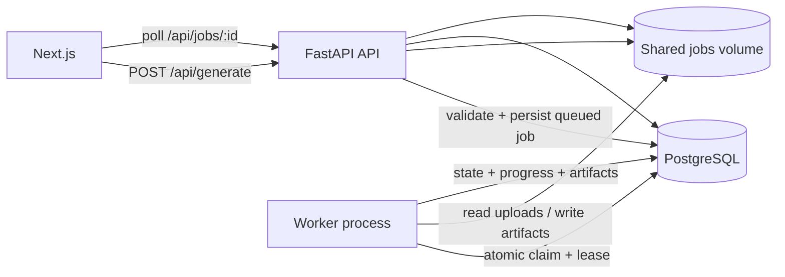

# PostgreSQL Job Persistence and Worker Foundation Implementation Plan

> **For agentic workers:** REQUIRED SUB-SKILL: Use `subagent-driven-development` to execute this plan task by task, and use `test-driven-development` for each behavior change.

**Goal:** Replace the production `jobs.json` and FastAPI in-process background execution path with a durable SQLModel/PostgreSQL job repository, an explicit job state machine, and a separately runnable worker, while preserving the current public API and frontend behavior.

**Architecture:** FastAPI validates and stores uploads, persists an owner-scoped queued job, and returns immediately. A separate worker atomically claims queued jobs through the database, renews a lease, invokes the existing single-courseware or course-outline pipeline, records progress/transitions/artifacts, and terminates the job in a durable state. PostgreSQL is the production queue and metadata store; SQLite remains supported for deterministic tests. Generated files continue to live in the job-owned filesystem volume.

**Tech Stack:** Python 3.11+, FastAPI, SQLModel/SQLAlchemy, PostgreSQL, SQLite test databases, Docker Compose, `unittest`, existing Next.js/Playwright frontend verification.

---

## 0. Scope and Non-Negotiable Contracts

Baseline commit:

```text
b271e38 文档：确定 JSON 到 HTML 的资料渲染架构
```

This plan implements the job execution foundation only. It must not implement
the approved HTML rendering architecture yet.

Preserve these public behaviors:

- existing auth/session/owner checks;
- `POST /api/generate` multipart fields and `service_mode` semantics;
- existing job URLs and artifact URLs;
- `status` compatibility values consumed by the frontend:
  `queued`, `running`, `completed`, `failed`;
- current Markdown output and `material_package` v1 artifacts;
- existing source identity and PDF preview contracts;
- deterministic test runner injection.

Do not change:

- parser selection or default parser behavior;
- MinerU pipeline adoption;
- `material-package.v2`, HTML generation, HTML themes, or Markdown removal;
- Soul Profiles, Knowledge Snippets, retrieval semantics, or prompts;
- frontend visual design;
- Cloudflare, domain, or live Tencent deployment;
- authentication product policy.

## 1. Target State

### 1.1 Internal Job States

The canonical persisted state is:

```python
class JobState(StrEnum):
    QUEUED = "queued"
    PARSING = "parsing"
    RETRIEVING = "retrieving"
    GENERATING = "generating"
    PACKAGING = "packaging"
    COMPLETED = "completed"
    FAILED = "failed"
    CANCELLED = "cancelled"
```

Allowed transitions:

```text
queued      -> parsing | cancelled
parsing     -> retrieving | queued | failed | cancelled
retrieving  -> generating | queued | failed | cancelled
generating  -> packaging | queued | failed | cancelled
packaging   -> completed | queued | failed | cancelled
completed   -> terminal
failed      -> terminal
cancelled   -> terminal
```

Retry transitions back to `queued` are worker-controlled only. Public API code
must not arbitrarily write state strings.

Compatibility projection:

```python
def public_status(state: JobState) -> str:
    if state is JobState.QUEUED:
        return "queued"
    if state in {
        JobState.PARSING,
        JobState.RETRIEVING,
        JobState.GENERATING,
        JobState.PACKAGING,
    }:
        return "running"
    if state is JobState.COMPLETED:
        return "completed"
    return "failed"
```

The job status response keeps `status` and may add:

```json
{
  "state": "retrieving",
  "stage": "retrieving",
  "progress": 35,
  "attempt_count": 1,
  "error_code": null
}
```

### 1.2 Persistence Tables

Add SQLModel tables with explicit names:

- `jobs`;
- `job_sources`;
- `job_sections`;
- `job_artifacts`;
- `job_transitions`.

Required relationships and invariants:

- every job has an immutable `id` and `owner_user_id`;
- every source belongs to one job and keeps immutable `source_id`;
- `(job_id, source_id)` is unique;
- section order is stable and unique within a job;
- artifact records use a controlled artifact kind, relative path, MIME type,
  byte size, and SHA-256;
- transitions are append-only;
- the repository never exposes another user's job;
- idempotency key uniqueness is scoped to an owner;
- leases are internal worker metadata and are never accepted from clients.

### 1.3 Execution Topology



The API process must not invoke the generation runner after the production
switch. The worker is a separately runnable process and a separate Compose
service.

## 2. Planned File Boundaries

Create:

```text
packages/core/jstudy_core/job_system/__init__.py
packages/core/jstudy_core/job_system/models.py
packages/core/jstudy_core/job_system/states.py
packages/core/jstudy_core/job_system/repository.py
packages/core/jstudy_core/job_system/service.py
packages/core/jstudy_core/job_system/worker.py
apps/worker/__init__.py
apps/worker/main.py
tests/test_job_states.py
tests/test_job_repository.py
tests/test_job_service.py
tests/test_job_worker.py
```

Modify only as required:

```text
apps/api/jstudy_api/app.py
apps/web/e2e/support/serve_backend.py
packages/core/jstudy_core/auth_db.py
packages/core/jstudy_core/pipeline.py
packages/core/jstudy_core/settings.py
packages/core/jstudy_core/storage.py
packages/core/jstudy_core/jobs.py
deploy/docker-compose/api.compose.yml
deploy/docker-compose/README.md
README.md
docs/architecture/overview.md
docs/roadmap.md
tests/test_web_mvp.py
tests/test_security_controls.py
tests/test_mvp_runner.py
```

`packages/core/jstudy_core/jobs.py` remains as a compatibility boundary during
this task. Production code must use `job_system`, but legacy imports required by
unchanged tests or external callers may be re-exported. Do not delete the
legacy JSON store until all call sites and migration consequences are reviewed.

## 3. Task 1: State Machine and SQL Models

**Files:**

- Create: `packages/core/jstudy_core/job_system/states.py`
- Create: `packages/core/jstudy_core/job_system/models.py`
- Create: `packages/core/jstudy_core/job_system/__init__.py`
- Create: `tests/test_job_states.py`
- Modify: `packages/core/jstudy_core/auth_db.py`

### Step 1: Write failing state tests

Cover:

- every allowed transition;
- every forbidden transition;
- public status projection;
- terminal-state detection;
- deterministic stage progress mapping;
- retry transition is rejected unless explicitly authorized.

Run:

```powershell
python -m unittest tests.test_job_states -v
```

Expected: fail because the state module does not exist.

### Step 2: Implement the minimum state module

Required public functions:

```python
def require_transition(
    current: JobState,
    target: JobState,
    *,
    allow_retry: bool = False,
) -> None: ...

def public_status(state: JobState) -> str: ...

def progress_for(state: JobState) -> int: ...

def is_terminal(state: JobState) -> bool: ...
```

Use typed exceptions. Do not let route or worker code duplicate transition
rules.

### Step 3: Write SQL model tests

Use a temporary SQLite database and verify:

- table creation;
- uniqueness of `(job_id, source_id)`;
- uniqueness of `(owner_user_id, idempotency_key)` when a key exists;
- cascade or explicit deletion behavior;
- UTC timestamp persistence;
- model defaults do not contain mutable shared objects.

### Step 4: Implement SQL models

The `Job` table must include at least:

```python
id: str
owner_user_id: int
service_mode: str
scenario_id: str
parser_profile_id: str
generation_mode: str | None
state: JobState
progress: int
attempt_count: int
max_attempts: int
lease_owner: str | None
lease_expires_at: datetime | None
idempotency_key: str | None
request_fingerprint: str | None
error_code: str | None
error_message: str | None
created_at: datetime
updated_at: datetime
started_at: datetime | None
finished_at: datetime | None
```

Store upload and artifact paths as normalized paths relative to the configured
jobs root. Reject absolute paths and parent traversal when converting them back
to filesystem paths.

### Step 5: Register tables

Rename the internal database bootstrap concept from auth-only to application
tables while preserving a compatibility alias if existing callers use
`create_auth_tables()`.

Run:

```powershell
python -m unittest tests.test_job_states tests.test_auth_service -v
```

Expected: pass.

## 4. Task 2: Durable Repository and Atomic Claims

**Files:**

- Create: `packages/core/jstudy_core/job_system/repository.py`
- Create: `tests/test_job_repository.py`

### Step 1: Write repository contract tests

Required cases:

- create and reload a job from a fresh repository/session;
- list sources in stable `source_id` order;
- owner lookup succeeds for the owner and returns not found for another user;
- transition appends one transition row;
- invalid transition rolls back without partial changes;
- two claim attempts cannot both acquire the same job;
- expired lease is requeued when attempts remain;
- expired lease fails with `worker_attempts_exhausted` when attempts are spent;
- worker completion clears lease metadata;
- artifact metadata survives repository restart;
- cleanup selection only returns terminal jobs older than the retention cutoff.

Run RED:

```powershell
python -m unittest tests.test_job_repository -v
```

### Step 2: Implement repository methods

Minimum interface:

```python
class JobRepository:
    def create_job(self, command: CreateJobCommand) -> JobSnapshot: ...
    def get_job(self, job_id: str) -> JobSnapshot | None: ...
    def get_owned_job(self, job_id: str, owner_user_id: int) -> JobSnapshot | None: ...
    def list_sources(self, job_id: str) -> list[JobSourceSnapshot]: ...
    def transition(self, job_id: str, target: JobState, event: TransitionEvent) -> JobSnapshot: ...
    def claim_next(self, worker_id: str, lease_seconds: int) -> JobSnapshot | None: ...
    def renew_lease(self, job_id: str, worker_id: str, lease_seconds: int) -> bool: ...
    def requeue_expired_leases(self, now: datetime) -> LeaseRecoveryResult: ...
    def record_artifacts(self, job_id: str, artifacts: list[ArtifactInput]) -> None: ...
```

Claiming must use a database compare-and-set/update condition. A Python
`threading.Lock` is not sufficient because API and worker are separate
processes.

For PostgreSQL, use row locking or an atomic conditional update. For SQLite
tests, use the closest deterministic transaction behavior supported by
SQLAlchemy. Test the outcome, not a database-specific SQL string.

### Step 3: Verify restart durability and contention

Run:

```powershell
python -m unittest tests.test_job_repository -v
```

Expected: all pass with a file-backed temporary SQLite database.

## 5. Task 3: Admission Service, Limits, and Idempotency

**Files:**

- Create: `packages/core/jstudy_core/job_system/service.py`
- Create: `tests/test_job_service.py`
- Modify: `packages/core/jstudy_core/settings.py`
- Modify: `packages/core/jstudy_core/storage.py`

### Step 1: Define typed admission errors

Use stable codes:

```text
unsupported_service_mode
invalid_outline
outline_too_large
too_many_pdfs
pdf_too_large
total_upload_too_large
invalid_pdf
queue_full
user_active_job_limit
idempotency_conflict
```

Public messages must not expose server paths or exception traces.

### Step 2: Add typed settings

Add environment-backed settings with conservative pilot defaults:

```text
JSTUDY_MAX_PDFS=20
JSTUDY_MAX_PDF_BYTES=52428800
JSTUDY_MAX_TOTAL_UPLOAD_BYTES=314572800
JSTUDY_MAX_OUTLINE_BYTES=5242880
JSTUDY_QUEUE_CAPACITY=100
JSTUDY_USER_ACTIVE_JOB_LIMIT=3
JSTUDY_WORKER_POLL_SECONDS=1
JSTUDY_WORKER_LEASE_SECONDS=300
JSTUDY_WORKER_MAX_ATTEMPTS=2
```

Existing single-PDF limits must remain effective. Validation must stream and
stop at the configured limit instead of reading an unbounded body into memory.

### Step 3: Implement idempotency

Support optional `Idempotency-Key` on `POST /api/generate`.

Fingerprint:

```text
service_mode
scenario_id
parser_profile_id
generation_mode
outline SHA-256
ordered list of (source_id, PDF SHA-256)
```

Behavior:

- no key: create a new job;
- same owner + same key + same fingerprint: return the existing job;
- same owner + same key + different fingerprint: return HTTP `409`;
- identical keys belonging to different users do not collide.

The database uniqueness constraint is authoritative. Handle a concurrent
duplicate insert without returning two jobs.

### Step 4: Test failed admission cleanup

When validation or idempotency rejects a submission, remove only the
newly-created temporary upload directory. Verify resolved containment beneath
the configured jobs root before deletion.

Run:

```powershell
python -m unittest tests.test_job_service -v
```

Expected: all admission, limits, ownership, and cleanup cases pass.

## 6. Task 4: Worker and Pipeline Progress

**Files:**

- Create: `packages/core/jstudy_core/job_system/worker.py`
- Create: `apps/worker/__init__.py`
- Create: `apps/worker/main.py`
- Create: `tests/test_job_worker.py`
- Modify: `packages/core/jstudy_core/pipeline.py`
- Modify: `tests/test_mvp_runner.py`

### Step 1: Write worker tests

Use deterministic injected runners and cover:

- one queued job is claimed and completed;
- service mode selects the existing correct runner;
- runner failure stores a safe error code/message;
- retryable failure returns to queued until `max_attempts`;
- permanent failure terminates immediately;
- lease is renewed during a long step;
- stale worker cannot complete a job after losing its lease;
- completed artifacts are indexed;
- state/progress sequence follows the state machine;
- worker restart can resume a previously queued job.

### Step 2: Add a narrow progress callback

The existing pipeline may accept:

```python
ProgressCallback = Callable[[JobState], None]
```

Invoke it only at existing natural boundaries:

```text
parsing
retrieving
generating
packaging
```

Do not split or redesign retrieval/generation logic in this task. Existing
callers that omit the callback must behave exactly as before.

### Step 3: Implement the worker

Required shape:

```python
class JobWorker:
    def run_once(self) -> bool: ...
    def run_forever(self, stop_event: Event | None = None) -> None: ...
```

Initial production concurrency is one job per worker process. Do not add
Celery, Redis, multiprocessing, or a plugin framework.

The worker must:

1. recover expired leases;
2. atomically claim one job;
3. resolve owner-safe input paths;
4. run the existing pipeline;
5. renew its lease;
6. index produced artifacts;
7. transition to completed or a typed failure/retry state.

`apps/worker/main.py` must be import-safe and expose a clear CLI/module entry:

```powershell
python -m apps.worker.main
```

Run:

```powershell
python -m unittest tests.test_job_worker tests.test_mvp_runner -v
```

Expected: pass.

## 7. Task 5: Switch FastAPI to Durable Submission

**Files:**

- Modify: `apps/api/jstudy_api/app.py`
- Modify: `tests/test_web_mvp.py`
- Modify: `tests/test_security_controls.py`

### Step 1: Write API compatibility tests first

Verify:

- generation returns while job remains queued;
- API process does not invoke the runner;
- optional idempotency behavior;
- compatibility `status` plus new state/progress fields;
- owner isolation across job, package, output, export, evidence, trace, and all
  source PDF endpoints;
- artifact endpoints fail safely before completion;
- unknown job and foreign-owned job remain indistinguishable;
- raw worker exception text is not returned.

### Step 2: Remove production `BackgroundTasks` execution

`POST /api/generate` must call the admission service and persist a queued job.
It must not schedule `run_job()` in FastAPI.

Keep dependency injection for tests:

```python
def create_app(
    *,
    job_repository: JobRepository | None = None,
    job_service: JobService | None = None,
    ...
) -> FastAPI: ...
```

Do not keep two active production execution paths controlled by a hidden
environment flag.

### Step 3: Preserve response compatibility

Existing frontend fields and URLs remain. Additive fields are allowed. The
frontend must not be forced to know lease or retry internals.

Run:

```powershell
python -m unittest tests.test_web_mvp tests.test_security_controls -v
```

Expected: pass.

## 8. Task 6: Real Frontend/E2E Compatibility

**Files:**

- Modify: `apps/web/e2e/support/serve_backend.py`
- Modify frontend tests only if an additive state field requires it

The E2E support process must start:

- the real FastAPI app;
- a real `JobWorker` loop in a separate background thread/process;
- the deterministic injected generation runner;
- a temporary SQL database and temporary jobs root.

Do not reintroduce FastAPI `BackgroundTasks` for E2E convenience.

Verify existing browser flows:

- register/login/me/logout/route guard;
- course-outline upload with one and two PDFs;
- queued/running/completed/failed UI;
- refresh recovery;
- multi-source switch;
- citation jump;
- no unexpected console errors;
- no horizontal overflow at approved viewports.

Run from `apps/web`:

```powershell
npm run lint
npm run typecheck
npm test
npm run build
npm run test:e2e
```

Expected: all existing checks pass without weakening assertions.

## 9. Task 7: Compose, Readiness, and Cleanup

**Files:**

- Modify: `deploy/docker-compose/api.compose.yml`
- Modify: `deploy/docker-compose/README.md`
- Modify: `README.md`
- Modify: `docs/architecture/overview.md`
- Modify: `docs/roadmap.md`

### Step 1: Add worker service

The Compose topology must include:

```text
postgres
jstudy-api
jstudy-worker
```

API and worker use:

- the same `JSTUDY_DATABASE_URL`;
- the same read/write jobs volume;
- the same provider/runtime settings;
- different commands;
- separate health/restart semantics.

Do not expose a worker port.

### Step 2: Readiness behavior

API readiness must distinguish:

- database unavailable;
- jobs storage unavailable;
- provider unavailable when probing is requested.

Worker freshness may be reported from a database heartbeat, but absence of a
worker must not make `/api/health` claim the API process itself is dead. Record
the distinction in deployment docs.

### Step 3: Cleanup

Add a worker-owned maintenance pass that:

- selects terminal jobs older than retention;
- validates every path under the jobs root;
- removes files;
- deletes related database records transactionally or records a retryable
  cleanup failure;
- never deletes active/leased jobs.

Do not add a second scheduler service in this task.

### Step 4: Document pilot schema strategy

This task may continue using SQLModel `create_all()` for the disposable pilot
database. State explicitly that a versioned migration tool and migration
runbook are required before production data becomes non-disposable. Do not
pretend `create_all()` is a production migration system.

## 10. Task 8: Full Verification and Delivery

### Step 1: Backend verification

```powershell
. "$env:USERPROFILE\.codex\scripts\Enter-CodexUtf8.ps1"
$env:PYTHONUTF8 = "1"
$env:PYTHONIOENCODING = "utf-8"
python -m compileall -q apps packages
python -m unittest discover -s tests -v
```

Expected: all tests pass.

### Step 2: Frontend verification

From `apps/web`:

```powershell
npm run lint
npm run typecheck
npm test
npm run build
npm run test:e2e
```

Expected: all checks pass.

### Step 3: Repository checks

```powershell
git diff --check
git status --short
git diff --stat b271e38
```

Confirm no secrets, runtime data, uploads, generated output, database files, or
excluded directories are staged.

### Step 4: Delivery report

Create:

```text
multi-agent/jstudy-product-build/reports/0006-job-persistence-worker-report.md
```

Report:

- baseline and final SHA;
- exact files changed;
- state-machine contract;
- repository/claim/idempotency behavior;
- API compatibility;
- worker and Compose commands;
- backend/frontend/E2E counts;
- skipped items and residual risks;
- whether the legacy JSON store remains and whether production imports it;
- requested Supervisor verdict.

Use Chinese commit messages. Do not push, merge, rebase, reset, clean, deploy, or
modify excluded paths.

## 11. Acceptance Gates

The task is not complete unless all gates pass:

1. API production path never runs the generation runner in-process.
2. A separately runnable worker completes both supported service modes.
3. Two workers cannot both claim one job.
4. A queued job survives API and worker restart.
5. Every state transition is validated and recorded.
6. Existing public `status` remains frontend-compatible.
7. Owner isolation covers every artifact and source endpoint.
8. Upload limits and idempotency are enforced with typed errors.
9. Existing backend, frontend, build, and browser tests pass.
10. Compose contains API, worker, PostgreSQL, and a shared jobs volume.
11. No HTML migration or MinerU pipeline switch is mixed into the change.
12. No runtime data, secret, or unrelated untracked directory is committed.
